# Rudist 🦀⚡

A Redis clone written in Rust for learning purposes. Implements core Redis functionality with a focus on performance and simplicity.

## Why Build This?
- Learn network programming and TCP protocols
- Implement fundamental data structures & algorithms 
- Understand memory management through Rust's ownership model
- Practice concurrent programming with multiple client connections

## Features

- ⚡ Single-threaded architecture with event loop
- 🔌 TCP connection support with multiple clients
- 📦 Core data types (Strings, Lists)
- 🔍 RESP (Redis Serialization Protocol) parser
- 🧮 Memory management and eviction

## Implementation Status

### Core Components
- [x] TCP Server
- [x] Client Connection Management
- [x] RESP Protocol Support (partial)
- [ ] Memory Limits & Eviction

### Supported Commands

#### Key Operations
- [x] DEL
- [x] EXISTS
- [x] EXPIRE
- [x] TTL

#### String Operations
- [x] SET
- [x] GET
- [x] INCR/DECR
- [x] APPEND

#### List Operations
- [ ] LPUSH/RPUSH
- [ ] LPOP/RPOP
- [ ] LLEN
- [ ] LRANGE

## Project Structure

```
src/
├── config/      # Server configuration
├── engine/      # Command processing
├── network/     # TCP & event handling
├── protocol/    # RESP implementation
├── storage/     # Core Storage Engine
└── utils/       # Helpers & error handling
```

## Architecture

*The diagram above illustrates the components and their interactions within Rudist.*

## Getting Started
[Coming Soon]

⚠️ **Note**: FOR NOW, this is a learning project. For production use, please use the official Redis server.
